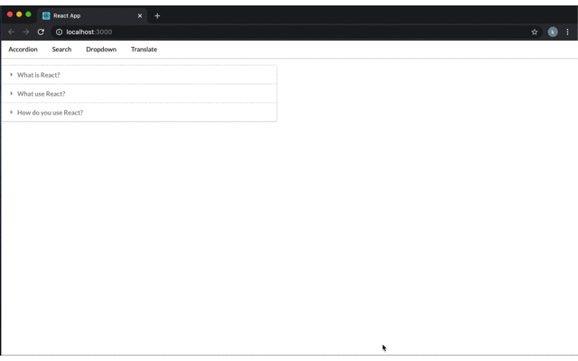

## Using React to Create Widgets

Using React, built an accordion menu, a search powered by Wikipedia, a dropdown menu, a text translator powered by google's api, and a navigation bar. 

Here is a meme showing how the widgets work:

### Search Wikipedia

The search tab use the wikipedia api to search for terms. 
Here is meme showing how this works:

### Use npm start to run

Runs the app in the development mode. 
Open [http://localhost:3000](http://localhost:3000) to view it in the browser.

The page will reload if you make edits. 
You will also see any lint errors in the console.

